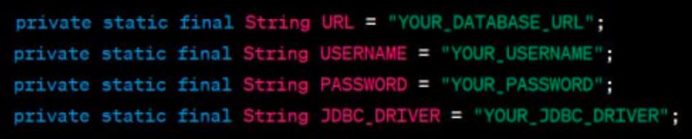

# Taxi Service
#### 

<p1>
A web app that supports user authentication and basic 
CRUD operations without relying on any external frameworks. Has UI that allows user to log in as 
driver and view/create/delete driver/car/manufacturer.
</p1>

## Project Structure:

#### The project employs an N-Tier Architecture:

1. DAO Layer (Data Access Object): Responsible for all interactions with the database, including CRUD operations.

2. Service Layer: Contains all the business logic of the application.

3. Controllers Layer: Facilitates user interaction with the application by providing a user interface and handling user requests, which are then passed to the service layer.

## Technologies Used:

* Java 11: The primary programming language.
* JDBC: For database connectivity.
* MySQL: As the database management system.
* Maven: For project management and build automation.
* Apache Tomcat (Version 9.0.76): Used for web hosting.
* JSP (JavaServer Pages): For dynamic web page generation.
* HTML: For structuring web content.
* SOLID Principles in Java: Ensuring a robust and maintainable codebase.
* Dependency Injection: For managing component dependencies.

### To Run This Application, Follow These Steps:
1. Fork this repository.

2. Clone the repository to your local machine.

3. Configure Apache Tomcat (Version 9.0.xx).

4. Create the required database tables using the init_db.sql file.

5. Edit the ConnectionUtil.java file to set your database connection parameters:
 
6. Run the project.

Please note that you should replace "YOUR_DATABASE_URL," "YOUR_USERNAME," "YOUR_PASSWORD," and "YOUR_JDBC_DRIVER" with your specific database connection details.
